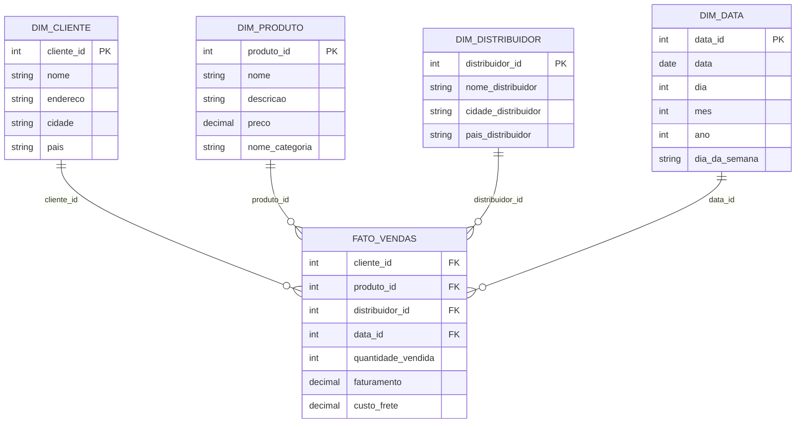

# On Market - modelo dimensional: star schema

Documento do **modelo dimensional** do **On Market DW** focado na representação em **star schema** da v1. Este arquivo complementa:

* `docs/03_modelo_dimensional/01_fato_dimensoes.md`
* `docs/03_modelo_dimensional/02_kpis.md`
* `docs/02_modelo_conceitual/03_diagrama_conceitual.md`

A ideia é mostrar, de forma visual e resumida, como a fato `dw.vendas` se conecta às dimensões principais e como isso responde às perguntas de negócio prioritárias.

---
## 1) Objetivo do documento

1. Representar o modelo dimensional v1 em formato de star schema.
2. Explicitar a tabela fato central e as dimensões ao redor.
3. Facilitar a leitura visual para quem está lendo o repositório ou os scripts de DDL.
4. Servir de referência rápida para BI, SQL e evolução futura do modelo.

---
## 2) Visão geral do star schema v1

O star schema da v1 é composto por:

* 1 tabela fato principal: `dw.vendas`
* 4 dimensões obrigatórias:
  * `dw.cliente`
  * `dw.produto`
  * `dw.distribuidor`
  * `dw.data`
* Dimensão `categoria` embutida como atributo em `dw.produto` (não há `dw.categoria` própria na v1).

Grão da fato:

* Uma linha por combinação de `produto` vendido, em uma `transacao` confirmada, em uma `data` de negócio.
* Na v1, o conceito de transação existe conceitualmente, mas não há coluna `transacao_id` explícita na fato.

---
## 3) Diagrama em Mermaid (star schema lógico)

Bloco Mermaid para visualização do star schema. Pode ser usado tanto em arquivo `.md` quanto em `.mmd` no VS Code.

Sugestão de mapeamento entre entidades do diagrama e tabelas físicas:

* `FATO_VENDAS` → `dw.vendas`
* `DIM_CLIENTE` → `dw.cliente`
* `DIM_PRODUTO` → `dw.produto`
* `DIM_DISTRIBUIDOR` → `dw.distribuidor`
* `DIM_DATA` → `dw.data`

---
## 4) Tabelas e colunas principais (visão sintética)

Resumo das tabelas do star schema v1. Os detalhes completos estão em `01_fato_dimensoes.md`, aqui é apenas uma visão compacta.

### 4.1 Fato `dw.vendas`

**Chaves estrangeiras:**

* `cliente_id` → `dw.cliente.cliente_id`
* `produto_id` → `dw.produto.produto_id`
* `distribuidor_id` → `dw.distribuidor.distribuidor_id`
* `data_id` → `dw.data.data_id`

**Medidas:**

* `quantidade_vendida`
* `faturamento`
* `custo_frete`

**Regras:**

* todas as FKs e medidas são `not null`
* `quantidade_vendida` > 0
* `faturamento` ≥ 0
* `custo_frete` ≥ 0 e limitado por uma fração máxima do faturamento

### 4.2 Dimensão `dw.cliente`

* Grão: um registro por cliente.

**Colunas principais:**

* `cliente_id`
* `nome`
* `endereco`
* `cidade`
* `pais`

Uso: cortes geográficos e análise por praça.

### 4.3 Dimensão `dw.produto`

* Grão: um registro por produto.

**Colunas principais:**

* `produto_id`
* `nome`
* `descricao`
* `preco`
* `nome_categoria`

Uso: análises por produto e categoria, top N, curva ABC.

### 4.4 Dimensão `dw.distribuidor`

* Grão: um registro por distribuidor.

**Colunas principais:**

* `distribuidor_id`
* `nome_distribuidor`
* `cidade_distribuidor`
* `pais_distribuidor`

Uso: comparações de custo de frete e desempenho logístico por distribuidor.

### 4.5 Dimensão `dw.data`

* Grão: um registro por dia.

**Colunas principais:**

* `data_id`
* `data`
* `dia`
* `mes`
* `ano`
* `dia_da_semana`

Uso: sazonalidade, tendências no tempo, recortes mensais e anuais.

---
## 5) Papel do star schema nas perguntas de negócio

O star schema foi desenhado para responder às perguntas essenciais de v1:

**Vendas e receita por mês, categoria e produto**

* fato `dw.vendas` + dimensões `dw.data` e `dw.produto`

**Top produtos por faturamento e quantidade**

* fato `dw.vendas` + `dw.produto`

**Ticket médio por período e por segmento básico**

* fato `dw.vendas` + `dw.data` + `dw.cliente` (proxy de ticket na v1)

**Custo de frete total, médio e peso sobre o faturamento**

* fato `dw.vendas` + `dw.produto` + `dw.distribuidor` + `dw.data`

**Participação geográfica de clientes e receita**

* fato `dw.vendas` + `dw.cliente` + `dw.data`

O fato de ter uma única tabela fato central com dimensões bem definidas simplifica:

* construção de consultas SQL
* criação de painéis em ferramentas de BI
* explicação do modelo para pessoas não técnicas

---
## 6) Boas práticas de uso do star schema

Alguns pontos de disciplina ao consumir este modelo:

1. Sempre usar `dw.data` como fonte de atributos temporais, evitando armazenar datas brutas duplicadas em outras tabelas.
2. Usar as chaves da fato para todas as análises; não cruzar dimensões entre si sem passar pela fato, exceto em casos específicos de lookup.
3. Para métricas derivadas, manter as fórmulas alinhadas com `docs/03_modelo_dimensional/02_kpis.md`.
4. Quando surgir necessidade de novos eixos de análise (por exemplo, categoria como dimensão própria, avaliações, transação), avaliar se o impacto é:
   * nova dimensão
   * nova ponte
   * ou extensão da fato

---
## 7) Critérios de aceite do star schema

O star schema descrito neste arquivo é considerado implantado quando:

1. As tabelas `dw.vendas`, `dw.cliente`, `dw.produto`, `dw.distribuidor` e `dw.data` existem no banco conforme o desenho dimensional.
2. As FKs de `dw.vendas` referenciam corretamente as dimensões, sem linhas órfãs.
3. Consultas básicas de validação (por exemplo, faturamento mensal, top produtos, custo de frete por categoria) executam com resultados coerentes.
4. O diagrama Mermaid deste arquivo reflete o que está implementado no DDL físico em `ddl/fisico/modelo_fisico.sql`.

---
## 8) Histórico do documento

* v0.3.0 primeira versão do documento de star schema, alinhada ao modelo dimensional v1 e aos KPIs básicos
---
